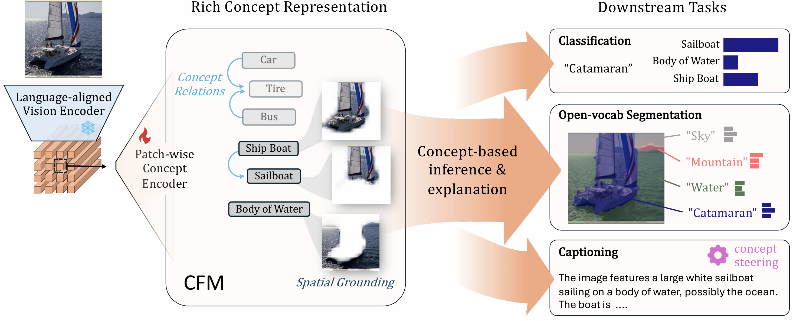

# CFM: Language-aligned Concept Foundation Model for Vision

<a href="https://explainablemachines.com/members/kai-wittenmayer.html">Kai Wittenmayer</a>,
<a href="https://sukrutrao.github.io">Sukrut Rao</a>,
<a href="https://m-parchami.github.io">Amin Parchami-Araghi</a>,
<a href="https://www.mpi-inf.mpg.de/departments/computer-vision-and-machine-learning/people/bernt-schiele">Bernt Schiele</a>,
<a href="https://explainablemachines.com/members/jonas-fischer.html">Jonas Fischer</a>

Max Planck Institute for Informatics, Saarland Informatics Campus, Saarbrücken, Germany  

<p align="center">
  <a href="assets/teaser.png">
    
  </a>
</p>

---

[](https://arxiv.org/abs/2601.13798)


---

## News
- arXiv preprint available.

---

## Contents
- [Abstract](#abstract)
- [Code](#code)
- [Citation](#citation)

## Abstract

Language-aligned vision foundation models perform strongly across diverse downstream tasks. Yet, their learned representations remain opaque, making interpreting their decision-making difficult. 
Recent work decompose these representations into human-interpretable concepts, but provide poor spatial grounding and are limited to image classification tasks.
In this work, we propose CFM, a *language-aligned concept foundation model for vision* that provides fine-grained concepts, which are human-interpretable and spatially grounded in the input image.
When paired with a foundation model with strong semantic representations, we get explanations for *any of its downstream tasks*. Examining local co-occurrence dependencies of concepts allows us to define concept relationships through which we improve concept naming and obtain richer explanations.
On benchmark data, we show that CFM provides performance on classification, segmentation, and captioning that is competitive with opaque foundation models while providing fine-grained, high quality concept-based explanations.

---
## Code
 
Code is available soon, stay tuned!

---
## Citation

If you find this work useful, please cite the arXiv preprint:

```tex
@article{wittenmayer2026insight,
  title  = {Insight: Interpretable Semantic Hierarchies in Vision-Language Encoders},
  author = {Wittenmayer, Kai and Rao, Sukrut and Parchami-Araghi, Amin and Schiele, Bernt and Fischer, Jonas},
  journal = {arXiv preprint arXiv:2601.13798},
  year   = {2026}
}
```
